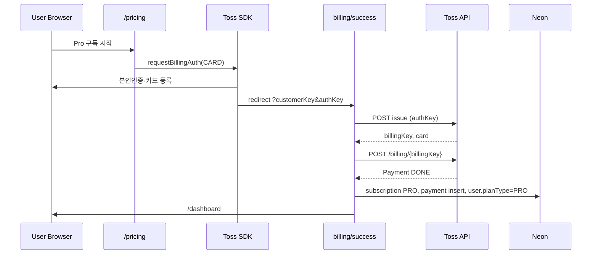
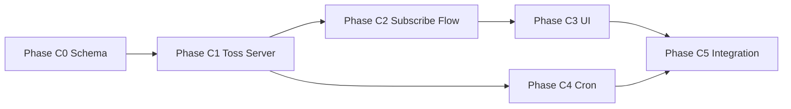

# LinkHub - Technical Specification

> **PRD 동기화**: `docs/prd/linkhub-prd.md` — 구독 결제 & 플랜 정책 (Epic 3, FR005~FR010)  
> **최종 갱신**: 2026-05-31 (Toss 빌링 + Vercel Cron 기준)

---

## Source Tree Structure

```
/ (Next.js 단일 리포지토리)
├─ docs/
│  ├─ prd/linkhub-prd.md
│  └─ tech-spec/linkhub-tech-spec.md
├─ app/
│  ├─ (public)/
│  │  ├─ login/page.tsx
│  │  ├─ pricing/page.tsx              # Free/Pro 비교 + 구독 CTA
│  │  └─ r/[slug]/page.tsx             # 단축 URL 리다이렉션 (Server Component)
│  ├─ dashboard/
│  │  ├─ page.tsx                      # 링크 + 구독 요약 카드
│  │  ├─ actions.ts                    # 링크 Server Actions
│  │  ├─ billing/
│  │  │  ├─ success/page.tsx           # 빌링키 발급 + 최초 결제 처리
│  │  │  └─ fail/page.tsx              # 카드 등록 실패 안내
│  │  └─ subscription/
│  │      ├─ page.tsx                  # 구독 관리 (상세·취소·결제 이력)
│  │      └─ actions.ts                # cancelSubscription 등
│  ├─ api/
│  │  ├─ auth/[...all]/route.ts
│  │  ├─ billing/
│  │  │  └─ customer-key/route.ts      # GET — 세션 기반 customerKey 발급/조회
│  │  └─ cron/
│  │      └─ billing-renewal/route.ts  # Vercel Cron — 월간 자동 갱신
│  └─ layout.tsx
├─ components/
│  ├─ ui/                               # ShadCN
│  └─ shared/
├─ features/
│  ├─ auth/components/
│  ├─ billing/
│  │  ├─ components/
│  │  │  ├─ subscribe-button.tsx      # Toss requestBillingAuth (Client)
│  │  │  ├─ subscription-summary-card.tsx
│  │  │  └─ payment-history-table.tsx
│  │  └─ actions.ts                    # (optional) re-export
│  └─ links/components/
├─ db/
│  ├─ schema/
│  │  ├─ index.ts
│  │  ├─ auth.ts
│  │  ├─ link.ts
│  │  ├─ subscription.ts              # 확장: customerKey, cancelAtPeriodEnd 등
│  │  └─ payment.ts                     # 신규: 결제 이력
│  └─ client.ts
├─ lib/
│  ├─ plan.ts / plan-constants.ts
│  ├─ billing/
│  │  ├─ config.ts                     # PRO_MONTHLY_PRICE, orderId 헬퍼
│  │  └─ period.ts                     # currentPeriodEnd 계산 (KST)
│  └─ slug.ts
├─ server/
│  ├─ auth/
│  ├─ billing/
│  │  ├─ toss.ts                       # Toss REST API 클라이언트
│  │  ├─ subscribe.ts                  # 구독 시작·갱신·만료 비즈니스 로직
│  │  ├─ cancel.ts                     # 구독 취소
│  │  └─ list-payments.ts
│  └─ links/
├─ scripts/
│  ├─ verify-env.ts
│  └─ run-cron-billing-renewal.ts      # 로컬 Cron 테스트
├─ types/
│  ├─ plan.ts
│  └─ billing.ts
├─ vercel.json                         # Cron 스케줄
├─ drizzle.config.ts
├─ package.json                        # cron:billing 스크립트
└─ .env.example
```

---

## Technical Approach

- 단일 Next.js 16(App Router) 애플리케이션으로 프런트·백엔드를 통합한다.
- **Server Actions 우선**: 링크 CRUD, 구독 취소 등 데이터 변경. **Route Handlers**: Toss API 콜백, Cron, customerKey 발급 등 외부/스케줄 전용.
- **Server Components 기본**: 대시보드·구독 관리·pricing은 RSC. Toss SDK만 Client Component.
- 단축 URL: `app/(public)/r/[slug]/page.tsx` Server Component (Edge API 없음).
- 인증: Better Auth + Kakao OAuth. 세션은 `requireSession()` / `getSession()`.
- DB: Neon Postgres + Drizzle ORM.
- **구독 결제**: Toss Payments **자동결제(빌링)** — SDK `requestBillingAuth` → 서버 빌링키 발급 → `POST /v1/billing/{billingKey}` 승인. **일반결제·웹훅 기반 1회성 결제는 사용하지 않음.**
- **자동 갱신**: Toss는 스케줄 미제공 → **Vercel Cron** (`/api/cron/billing-renewal`) + 로컬 `pnpm cron:billing`.
- 플랜 정책: `lib/plan-constants.ts` + `getEffectivePlanType()` — `user.planExpiresAt` 경과 시 Free.
- 구독 취소: DB `cancelAtPeriodEnd = true`만 설정. **만료일까지 Pro 유지**, Cron이 해당 구독 갱신 스킵.

---

## Implementation Stack

| 영역 | 기술 |
|------|------|
| 프런트 | Next.js 16, RSC, Server Actions, TypeScript, Tailwind 4, ShadCN UI |
| 백엔드 | Route Handlers(Cron·billing API), Drizzle ORM |
| DB | Neon Postgres |
| 인증 | Better Auth, Kakao OAuth |
| 결제 | **@tosspayments/tosspayments-sdk** (v2), Toss Billing REST API |
| 스케줄 | **Vercel Cron** (`vercel.json`) |
| 검증 | Zod |
| HTTP | `fetch` (Toss API — Axios 불필요) |
| 배포 | Vercel |

---

## Technical Details

### 1. 링크 생성 및 전달 (FR001~FR003)

- **Link**: `id`, `userId`, `originalUrl`, `slug`(unique), `expiresAt`, `clickLimit`, `clickCount`, `status`, `createdAt`, `updatedAt`
- Free: 일 5개 / 활성 30개 (`lib/plan-constants.ts`). Pro: 무제한.
- 생성: `server/links/create-link.ts` + `app/dashboard/actions.ts`
- 리다이렉션: `server/links/resolve-link.ts` → `redirect(originalUrl)`

### 2. 회원 및 플랜 (FR004, FR007)

- **User**: `planType`, `planExpiresAt` (Better Auth additionalFields)
- **Subscription** (1 user : 1 subscription, 가입 시 FREE 행 생성):
  - 기존: `id`, `userId`, `planType`, `status`, `currentPeriodEnd`, `billingKey`, `createdAt`
  - **추가**: `customerKey`, `cancelAtPeriodEnd`(boolean, default false), `currentPeriodStart`, `lastPaymentAt`
- **Payment** (신규):

```typescript
// db/schema/payment.ts 요약
paymentStatusEnum: "DONE" | "FAILED" | "CANCELED"
payment: {
  id, userId, subscriptionId,
  orderId,      // unique — Toss 주문번호
  paymentKey,   // nullable (실패 시)
  amount,       // integer KRW
  method,       // "현대 433012******123*" 등
  status, paidAt, failureMessage, createdAt
}
```

- **플랜 한도**: `evaluatePlanLimits()`, `canCreateLink()` — `getEffectivePlanType()`이 `planExpiresAt` 기준 Pro/Free 판정.

### 3. Toss Payments 자동결제(빌링) (FR005, FR008~FR010)

> 구현 시 **Toss MCP** (`tosspayments-integration-guide`)로 API 스펙 재확인.

#### 3.1 환경 변수

| 변수 | 필수 | 설명 |
|------|------|------|
| `TOSS_CLIENT_KEY` | ✅ | SDK 초기화 (자동결제 계약 MID) |
| `TOSS_SECRET_KEY` | ✅ | 서버 API Basic auth |
| `NEXT_PUBLIC_TOSS_CLIENT_KEY` | ✅ | Client Component용 (또는 서버에서 props 전달) |
| `PRO_MONTHLY_PRICE` | ✅ | Pro 월 요금 정수 (예: `9900`) |
| `CRON_SECRET` | ✅ | Cron Bearer 토큰 (32+ chars random) |

#### 3.2 API 엔드포인트 (Toss)

| 단계 | Method | Path | 용도 |
|------|--------|------|------|
| 빌링키 발급 | POST | `/v1/billing/authorizations/issue` | `{ authKey, customerKey }` |
| 자동결제 승인 | POST | `/v1/billing/{billingKey}` | `{ customerKey, amount, orderId, orderName }` |
| 빌링키 삭제 | DELETE | `/v1/billing/{billingKey}` | MVP optional |

- 인증: `Authorization: Basic ${Buffer.from(secretKey + ":").toString("base64")}`
- `customerKey`: UUID v4, user당 1개. `subscription.customerKey`에 저장.
- `orderId`: `lh_{userId.slice(0,8)}_{Date.now()}` — **매 결제 고유**, DB unique.

#### 3.3 구독 시작 시퀀스



#### 3.4 구독 기간 계산 (`lib/billing/period.ts`)

- **KST 기준** 통일 (PRD: 갱신 1일 03:00 KST).
- **최초 구독** `currentPeriodEnd`: 구독 시작 시점 기준 **다음 달 1일 02:59:59.999 KST** (또는 +1 calendar month — 팀 정책 하나로 고정).
- **갱신 성공**: `currentPeriodStart = oldEnd`, `currentPeriodEnd = addOneMonth(oldEnd)`.
- **user.planExpiresAt** = `subscription.currentPeriodEnd` (플랜 유틸과 동기화).

#### 3.5 구독 상태 전이

| 이벤트 | subscription | user |
|--------|--------------|------|
| 최초 결제 성공 | `ACTIVE`, `planType=PRO`, billingKey 저장 | `planType=PRO`, `planExpiresAt=end` |
| 사용자 취소 | `CANCELED`, `cancelAtPeriodEnd=true` | 변경 없음 (만료까지 PRO) |
| Cron 갱신 성공 | `ACTIVE`, period 연장, `lastPaymentAt` | `planExpiresAt` 갱신 |
| Cron 갱신 실패 | `PAST_DUE` | 만료까지 PRO (MVP) |
| 만료 (Cron 후처리) | `FREE`/`ACTIVE`+Free planType | `planType=FREE`, `planExpiresAt=null` |

#### 3.6 구독 취소 (FR009)

- `cancelSubscription` Server Action → `server/billing/cancel.ts`
- **PG API 호출 없음**. `cancelAtPeriodEnd=true`, `status=CANCELED`.
- `getEffectivePlanType()`: `planExpiresAt > now()` 이면 Pro 유지.

#### 3.7 UI 라우트

| 경로 | 역할 |
|------|------|
| `/pricing` | 플랜 비교, SubscribeButton |
| `/dashboard` | SubscriptionSummaryCard |
| `/dashboard/subscription` | 상세·취소·결제 이력 |
| `/dashboard/billing/success` | authKey 처리 (Server) |
| `/dashboard/billing/fail` | 실패 코드·메시지 |

### 4. Vercel Cron 자동 갱신 (FR010)

#### 4.1 `vercel.json`

```json
{
  "crons": [
    {
      "path": "/api/cron/billing-renewal",
      "schedule": "0 18 28-31 * *"
    }
  ]
}
```

- UTC 18:00 (28–31일) = KST 다음날 03:00 (월말→익월 1일 케이스).
- 핸들러 내부: `isBillingRenewalWindowKst()` — KST `hour===3 && date===1` (±15분 허용 optional).

#### 4.2 Cron 핸들러 로직 (`server/billing/subscribe.ts` → `renewDueSubscriptions()`)

1. `Authorization: Bearer ${CRON_SECRET}` 검증
2. (Production) KST 1일 03:00 윈도우 검증 — 로컬 `--force`는 스크립트에서 `?force=1` + secret
3. 대상 쿼리:
   ```sql
   status = 'ACTIVE'
   AND cancel_at_period_end = false
   AND billing_key IS NOT NULL
   AND current_period_end <= now()
   ```
4. 각 구독: `chargeBilling()` → 성공/실패 DB 반영
5. **멱등성**: `orderId` unique + 결제 전 insert `payment`(PENDING) optional
6. **만료 후처리**: `currentPeriodEnd < now()` && 갱신 스킵된 CANCELED/PAST_DUE → Free 다운그레이드

#### 4.3 로컬 테스트

```bash
pnpm dev          # :3002
pnpm cron:billing              # KST 검증 통과 시에만 실행
pnpm cron:billing -- --force   # KST 검증 스킵
```

`scripts/run-cron-billing-renewal.ts`:
- `CRON_SECRET` from `.env.local`
- `fetch(\`${BETTER_AUTH_URL}/api/cron/billing-renewal?force=1\`, { headers: { Authorization: \`Bearer ${CRON_SECRET}\` } })`

### 5. 비기능 요구사항

- **NFR001**: slug unique index, 단일 쿼리 리다이렉션
- **NFR002**: pricing·구독 관리 반응형, Toss 등록창 모바일 확인
- **NFR003**: 대시보드 구독 요약 + 결제 이력 + Cron/결제 structured log (`console` 또는 pino)

---

## Development Setup

1. Node.js 20.9+, pnpm
2. `pnpm install`
3. `cp .env.example .env.local` — DB, Auth, **Toss, CRON_SECRET, PRO_MONTHLY_PRICE** 입력
4. `@tosspayments/tosspayments-sdk` 설치: `pnpm add @tosspayments/tosspayments-sdk`
5. `pnpm db:push` — subscription 확장 + payment 테이블
6. `pnpm dev` → `http://localhost:3002`
7. Toss 테스트: 개발자센터 테스트 키, 본인인증 `000000`
8. Cron 로컬: `pnpm cron:billing -- --force`

---

## 구독 결제 개발 플랜 (Track C)

> **전제**: Epic 2(인증·플랜) 및 Track A/B(링크·리다이렉션) 완료 상태.  
> **예상 소요**: 5 Phase, Phase당 0.5~1.5일 (1인 기준)

### Phase C0 — 스키마·설정 기반 (선행 필수)

**목표**: DB·env·공통 유틸 준비. 이후 Phase 병렬 가능성 낮음 — **반드시 먼저**.

| # | 작업 | 파일 | 완료 기준 |
|---|------|------|-----------|
| C0-1 | payment 스키마 | `db/schema/payment.ts` | Drizzle enum + table |
| C0-2 | subscription 확장 | `db/schema/subscription.ts` | 4컬럼 추가 |
| C0-3 | schema export | `db/schema/index.ts` | payment export |
| C0-4 | env 템플릿 | `.env.example` | Toss·Cron·Price |
| C0-5 | billing config | `lib/billing/config.ts` | `getProMonthlyPrice()`, `createOrderId()` |
| C0-6 | period 유틸 | `lib/billing/period.ts` | KST endOfPeriod, addMonth |
| C0-7 | types | `types/billing.ts` | Toss 응답·PaymentStatus |
| C0-8 | DB 반영 | — | `pnpm db:push` 성공 |

**검증**: Drizzle Studio에서 `payment` 테이블·subscription 신규 컬럼 확인.

---

### Phase C1 — Toss 서버 클라이언트 (Phase C0 후)

**목표**: REST 연동 격리. UI 없이 curl/스크립트로 API shape 검증 가능.

| # | 작업 | 파일 | 완료 기준 |
|---|------|------|-----------|
| C1-1 | Toss client | `server/billing/toss.ts` | `issueBillingKey`, `chargeBilling`, `TossApiError` |
| C1-2 | subscribe service | `server/billing/subscribe.ts` | `activateSubscription()`, `renewDueSubscriptions()` |
| C1-3 | cancel service | `server/billing/cancel.ts` | `cancelSubscriptionAtPeriodEnd()` |
| C1-4 | list payments | `server/billing/list-payments.ts` | userId 최신 20건 |

**`server/billing/toss.ts` 인터페이스 (목표)**:

```typescript
export async function issueBillingKey(input: {
  authKey: string;
  customerKey: string;
}): Promise<{ billingKey: string; method: string; cardLabel: string }>;

export async function chargeBilling(input: {
  billingKey: string;
  customerKey: string;
  amount: number;
  orderId: string;
  orderName: string;
}): Promise<{ paymentKey: string; approvedAt: string; receiptUrl?: string }>;
```

**검증**: 테스트 secretKey로 issue/charge 타입체크. (실 카드는 Phase C2)

---

### Phase C2 — 구독 시작 플로우 (Phase C1 후)

**목표**: Free → Pro 최초 전환 E2E.

| # | 작업 | 파일 | 완료 기준 |
|---|------|------|-----------|
| C2-1 | customerKey API | `app/api/billing/customer-key/route.ts` | GET, 세션 필수, UUID 발급/재사용 |
| C2-2 | SubscribeButton | `features/billing/components/subscribe-button.tsx` | requestBillingAuth |
| C2-3 | pricing 페이지 | `app/(public)/pricing/page.tsx` | 5/30 vs Pro, 가격, CTA |
| C2-4 | success page | `app/dashboard/billing/success/page.tsx` | authKey→issue→charge→redirect |
| C2-5 | fail page | `app/dashboard/billing/fail/page.tsx` | code/message 표시 |

**success page 핵심 로직**:

1. `requireSession()`
2. Zod: `customerKey`, `authKey` query
3. DB: `subscription.customerKey === query.customerKey` (또는 userId 매칭)
4. `issueBillingKey` → `chargeBilling` (amount = server env)
5. 트랜잭션: subscription update, payment insert, user update
6. `redirect("/dashboard?subscribed=1")`

**검증 체크리스트**:

- [ ] `/pricing` → 카드 등록 → success → 대시보드 Pro
- [ ] DB: `billing_key`, `payment` 1건 DONE
- [ ] `evaluatePlanLimits` → 무제한
- [ ] 실패 URL → fail 페이지

---

### Phase C3 — 구독 UI·취소 (Phase C2 후, C4와 일부 병렬 가능)

**목표**: FR007~FR009 — 대시보드 요약, 구독 관리, 취소.

| # | 작업 | 파일 | 완료 기준 |
|---|------|------|-----------|
| C3-1 | Summary card | `features/billing/components/subscription-summary-card.tsx` | 상태·만료일·링크 |
| C3-2 | dashboard 통합 | `app/dashboard/page.tsx` | 카드 추가 |
| C3-3 | subscription page | `app/dashboard/subscription/page.tsx` | 정보·액션·이력 |
| C3-4 | Payment table | `features/billing/components/payment-history-table.tsx` | 5컬럼 |
| C3-5 | cancel action | `app/dashboard/subscription/actions.ts` | cancelAtPeriodEnd |
| C3-6 | Cancel dialog | ShadCN AlertDialog | 2단계 확인 |

**검증 체크리스트**:

- [ ] 대시보드: 구독 상태·만료일·「구독 관리」
- [ ] 구독 관리: 시작일·마지막 결제일·이력 테이블
- [ ] 취소 후: status CANCELED, **Pro 기능 유지**, Cron 대상 제외

---

### Phase C4 — Vercel Cron 갱신 (Phase C1 후, C2와 병렬 가능)

**목표**: FR010 — 월간 자동결제 + 로컬 테스트 스크립트.

| # | 작업 | 파일 | 완료 기준 |
|---|------|------|-----------|
| C4-1 | Cron route | `app/api/cron/billing-renewal/route.ts` | Bearer + renewDueSubscriptions |
| C4-2 | KST window | `lib/billing/period.ts` | `shouldRunBillingCron()` |
| C4-3 | vercel.json | `vercel.json` | cron schedule |
| C4-4 | local script | `scripts/run-cron-billing-renewal.ts` | --force 지원 |
| C4-5 | package.json | `"cron:billing": "tsx ..."` | tsx devDependency |
| C4-6 | expire job | `server/billing/subscribe.ts` | CANCELED 만료 → Free |

**검증 체크리스트**:

- [ ] DB에 `currentPeriodEnd` 과거인 ACTIVE 구독 seed
- [ ] `pnpm cron:billing -- --force` → payment 2번째 row, period +1month
- [ ] `cancelAtPeriodEnd=true` 구독은 스킵
- [ ] 잘못된 CRON_SECRET → 401

---

### Phase C5 — 통합·운영 (Phase C2~C4 완료 후)

| # | 작업 | 파일 | 완료 기준 |
|---|------|------|-----------|
| C5-1 | verify-env | `scripts/verify-env.ts` | Toss·Cron·Price |
| C5-2 | pricing 수치 | `app/(public)/pricing/page.tsx` | 5/30 (현재 10/50 placeholder 수정) |
| C5-3 | getEffectivePlanType | `lib/plan-constants.ts` | subscription.status CANCELED + 만료 전 PRO |
| C5-4 | 수동 QA doc | PRD Epic 3 구독 체크리스트 | 전 항목 통과 |

**통합 E2E 시나리오**:

1. Free 로그인 → pricing → Pro 구독 → 커스텀 슬러그 생성
2. 구독 관리 → 결제 이력 1건 확인
3. 구독 취소 → 슬러그 여전히 가능
4. Cron force → 갱신 or 만료 시 Free
5. Free → 「다시 구독하기」

---

### Phase 의존성 다이어그램



### 구현 순서 (권장 일정)

| 일차 | Phase | 산출물 |
|------|-------|--------|
| 1 | C0 + C1 | schema, toss.ts, subscribe.ts |
| 2 | C2 | pricing, subscribe button, success/fail |
| 3 | C3 | dashboard card, subscription page, cancel |
| 4 | C4 | cron route, vercel.json, local script |
| 5 | C5 | verify-env, QA, edge cases |

---

## Implementation Guide (Epic 요약)

1. **Epic 1** ✅ — 프로젝트·DB·ShadCN
2. **Epic 2** ✅ — Auth, plan.ts, dashboard 골격
3. **Epic 3 Track A/B** ✅/진행 — 링크·리다이렉션
4. **Epic 3 Track C** — 위 **Phase C0~C5** 순서
5. **Epic 3 Track D** — verify-env, Vercel deploy, Cron Production 확인

---

## Testing Approach

| 레벨 | 대상 | 방법 |
|------|------|------|
| 유닛 | `lib/billing/period.ts`, `createOrderId()` | Jest 또는 node assert |
| 유닛 | `getEffectivePlanType()` + CANCELED + planExpiresAt | table-driven |
| 통합 | `server/billing/toss.ts` | Toss 테스트 키, MSW mock optional |
| 통합 | Cron route | supertest + fake secret |
| E2E | pricing → subscribe → dashboard | Playwright (optional) |
| 수동 | Toss 테스트 카드 | BIN 6자리 유효 (테스트 env) |

**보안**: customerKey 세션 매칭, amount 서버 전용, CRON_SECRET 필수, billingKey 클라이언트 미노출.

---

## Deployment Strategy

- **Vercel Production**: `TOSS_*`, `CRON_SECRET`, `PRO_MONTHLY_PRICE` Secret 등록
- **vercel.json** Cron Production 활성화 확인 (Hobby: 1 cron/day 제한 — Pro 필요 시 문서화)
- **Toss successUrl/failUrl**: `https://{domain}/dashboard/billing/success|fail`
- **Prebuild**: `scripts/verify-env.ts`
- **DB**: `pnpm db:push` on Neon production
- **모니터링**: Cron 실행 로그, `payment.status=FAILED` 집계

---

## 부록: PRD Story ↔ Phase 매핑

| PRD Story | Phase |
|-----------|-------|
| 3.8 pricing | C2 |
| 3.9 Toss 빌링 | C0, C1, C2 |
| 3.10 구독 UI | C3 |
| 3.11 Vercel Cron | C4 |
| 3.12 verify-env | C5 |
| 3.13 Vercel deploy | C5 + Track D |
